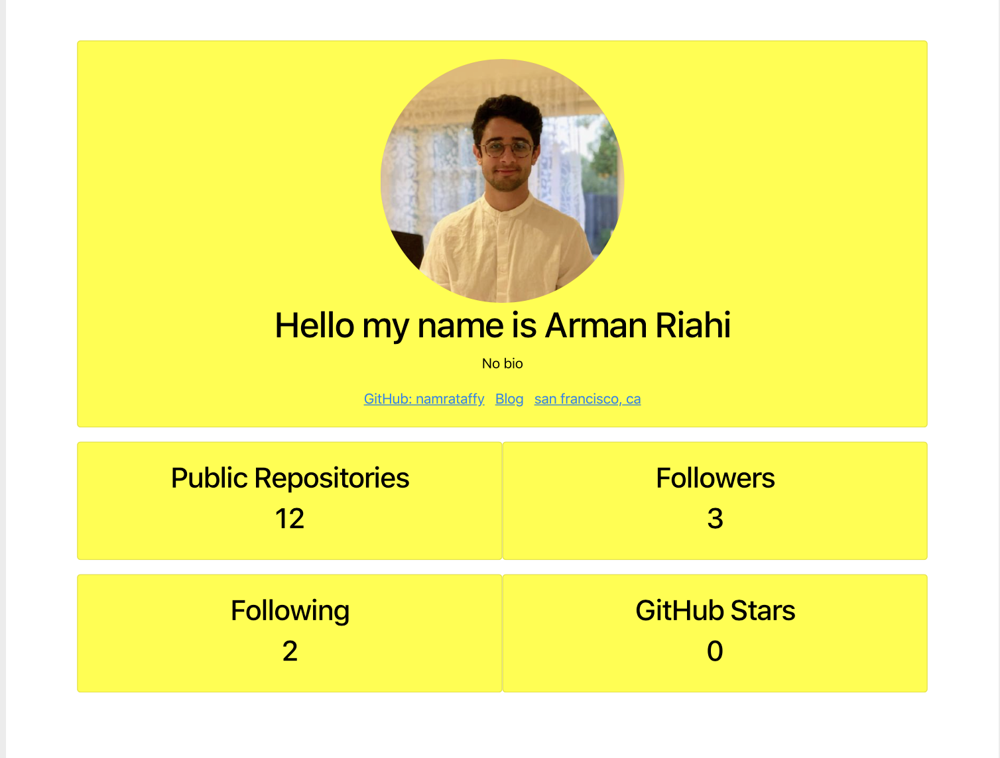

# Developer-Profile-Generator

<br>

# Summary

This is an app that allows a user to generate a pdf profile from a guthub username and color. This app is ran in the terminal via node.js.
<br>

# Sample Images

Home Screen

<br>

# Technologies

- HTML
- CSS
- VScode
- Git
- GitHub
- Javascript

# Author

Arman Riahi

# Links

[LinkedIn](https://www.linkedin.com/in/arman-riahi/)
<br>

[GitHub](https://github.com/namrataffy)
<br>

# Code Snippet

Code showing how pdf is rendered:

```
    .then(res => {
      conversion({ html: res }, function(err, result) {
        console.log(res);

        if (err) {
          return console.error(err);
        }
        result.stream.pipe(fs.createWriteStream("thing2.pdf"));
        conversion.kill();
      });
    });
});
```
